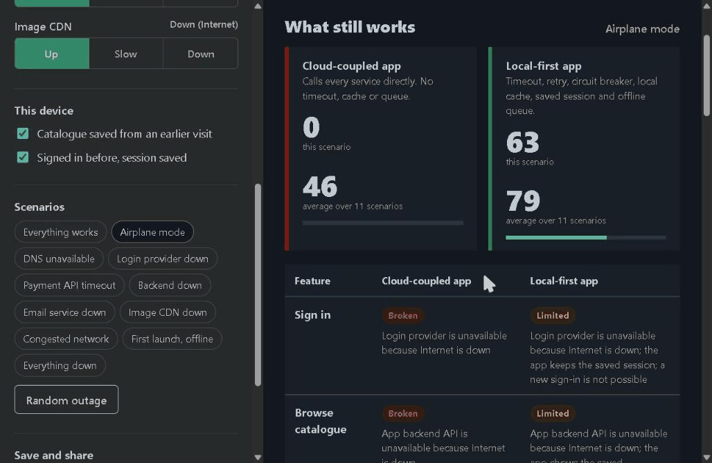

# Outage Lab

**Your app talks to the internet, DNS, a login provider, a payment API, an email service and a CDN. What still works when they stop answering?**

Outage Lab is a free, offline-first teaching simulator. Flip switches to cut the internet, break DNS, take login offline or make a payment API time out. The same small shop is built twice, once coupled to the cloud and once local-first, and the lab shows which features keep working, which degrade, and which break, and why.



Everything is simulated in the browser. There are no real accounts, API keys, payments or network calls, and no runtime dependencies.

## What you can do

- **Switchboard.** Seven outside services, each set to Up, Slow (with a delay slider up to 15 s) or Down. Internet and DNS are prerequisites for every remote service, so their failures cascade.
- **Device state.** Choose whether the device already has a saved catalogue and a saved login session. A first launch while offline behaves very differently from a returning user.
- **Eleven scenario presets** plus a random outage generator.
- **Feature table.** Eight features, each judged for both designs with a plain-language reason for every result.
- **Resilience score.** 0 to 100 for the current scenario, and the average across all presets.
- **Dependency map.** An SVG graph from network to services to features. Failing calls are red, fallbacks are dashed.
- **Real shopping trip.** Both designs run the same eight steps against the simulated services with real timeouts, retries with backoff, circuit breakers, a local cache and an offline queue. Every step has a log.
- **Offline queue.** Work saved during an outage can be sent after you restore the services. Payments use an idempotency key, so a replayed order is never charged twice.
- **Data ownership.** Download everything the local-first app stored on the device as JSON.
- **Share and save.** Every scenario has a compact share link (for example `#s=v1-d.u.u.u.u.u.u-11`) and can be downloaded or loaded as a JSON file.
- **Works on phones.** On narrow screens the controls stack above the results, and the wide comparison table scrolls inside its own box instead of widening the page.
- **The page itself survives an outage.** A service worker caches the app after the first visit, and it loads no external fonts, scripts or images.

## Results for the built-in scenarios

| Scenario | Cloud-coupled app | Local-first app |
| --- | --- | --- |
| Everything works | 100 | 100 |
| Airplane mode | 0 | 63 |
| DNS unavailable | 0 | 63 |
| Login provider down | 25 | 88 |
| Payment API timeout | 88 | 94 |
| Backend down | 38 | 81 |
| Email service down | 75 | 94 |
| Image CDN down | 88 | 94 |
| Congested network | 88 | 94 |
| First launch, offline | 0 | 38 |
| Everything down | 0 | 63 |
| **Average** | **46** | **79** |

A feature scores 1 when it works, 0.5 when it is limited and 0 when it is broken. These numbers come from `web/core/engine.js` and are checked by the tests.

## The two designs

| Feature | Cloud-coupled app calls | Local-first app calls | Local-first fallback |
| --- | --- | --- | --- |
| Sign in | login provider | login provider | keep the saved session |
| Browse catalogue | backend, login provider | backend | saved catalogue |
| Product photos | CDN | CDN | text placeholders |
| Search | backend, login provider | backend | search the saved catalogue |
| Cart | backend, login provider | nothing | always local |
| Checkout and pay | login provider, backend, payment, email | login provider, backend, payment | saved session, offline queue |
| Email receipt | email | email | offline queue |
| Export my data | backend, login provider | nothing | always local |

Two lessons show up quickly. The cloud-coupled checkout sends the confirmation email inside the payment flow, so an email outage blocks sales. And it validates the session with the login provider on every screen, so a login outage takes down browsing too.

See [docs/MODEL.md](docs/MODEL.md) for the exact rules and simplifications.

## Run locally

Requires Node.js 22 or newer.

```sh
npm ci
npm start
```

Open `http://localhost:8080`. The server binds to `127.0.0.1` only. `npm ci` installs test tools only; the app has no runtime dependencies. Set `PORT` to use another port.

## Test

```sh
npm run check
```

The suite covers the engine, share codes, JSON import validation, the resilience patterns, both storage backends, the static server, the service worker file list, every translation key, and a jsdom test that drives the real page. The most important test, `tests/consistency.test.js`, runs both real client implementations through every preset and 40 seeded random outages and fails if the actual behaviour ever differs from what the feature table claims.

The jsdom test checks wiring and rendering. It does not replace checks in real browsers, on phones or with screen readers.

## Publish on GitHub Pages

1. Push the repository to GitHub.
2. Open **Settings**, then **Pages**, and set **Source** to **GitHub Actions**.
3. Push to `main`. The `Deploy to GitHub Pages` workflow runs the tests and publishes the `web` folder.

When you change any file in `web/`, bump `VERSION` in `web/sw.js` so returning visitors get a consistent offline copy.

## Project layout

```
web/
  index.html, styles.css, sw.js, manifest.webmanifest, icon.svg
  core/
    dependencies.js   the outside services
    features.js       the two designs, declared as data
    engine.js         pure evaluation: effective status, feature results, scores
    scenarios.js      presets, share codes, JSON import/export, seeded chaos
    patterns.js       timeout, retry with backoff, circuit breaker, offline queue
    store.js          memory and IndexedDB key-value stores
    services.js       simulated services with an idempotent payment ledger
    clients.js        the cloud-coupled and local-first client implementations
    clock.js          scaled logical clock
    i18n.js           English UI strings
  ui/
    app.js, graph.js
scripts/serve.js      zero-dependency local server
tests/                node:test suites
docs/MODEL.md         rules and simplifications
```

The `core` modules are plain ES modules with no browser or Node dependencies, so the same code runs in the page and in the tests. You can reuse `patterns.js` in your own projects.

## Contributing

Read [CONTRIBUTING.md](CONTRIBUTING.md). Good first contributions: another sample app, a new failure type such as packet loss or partial DNS caching, or a pattern such as bulkheads or request hedging.

## License

[MIT](LICENSE). Built by WENSLink.
